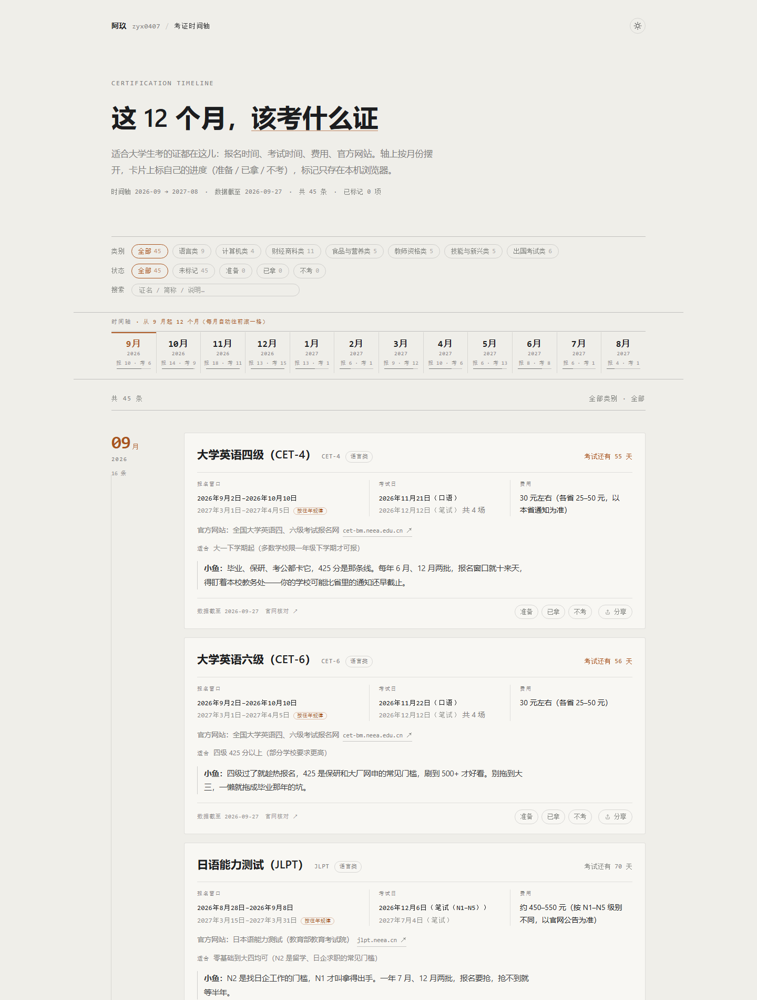

# 大学生考证时间轴

给大学生看的一条**考证时间轴**：月份轴 + 证书卡片 + 筛选 + 自己的进度标记 + 每张卡的二维码分享。

**打开就能用**：https://work1.zyx0407.com/

## 是什么

- **45 张证 / 7 类**：语言 · 计算机 · 财经商科 · 食品与营养 · 教师资格 · 技能新兴 · 出国。
- **月份轴**：从**当前月**起滚动 12 个月（每月自动往前滚一格，不用手工修数据），轴上按月份标出报名窗口与考试日，往下滚会**吸在顶部**。
- **每张卡**给四件套：**官方网站 · 费用 · 报名时间 · 考试时间**；下面那段「**小鱼：…**」是说人话的提醒（什么时候考合适、卡什么条件、哪个坑别踩）。
- **进度标记**：每张卡可标「准备 / 已拿 / 不考」，**只存在你自己的浏览器**里（localStorage），不上传、不跨设备。
- **分享**：每张卡右侧的「分享」键 → 二维码 + 链接。手机扫码直接落到那张卡上。

## 怎么用

- 顶栏右上角那枚圆钮切 **白天 / 深夜**（默认跟随系统）。
- 类别 / 状态 / 搜索三排筛选；搜索先认证名与简称，没命中才去翻说明正文。
- 地址栏可以直接带参数：`?card=cpa` 定位到某张卡 · `?cat=语言` 预筛类别 · `?theme=night` 强制深夜。

## 它是怎么做的

纯静态、**零依赖、零构建、零第三方库**——一个 `index.html`、一份数据、几段原生 JS/CSS，连**二维码都是自己写的**（字节模式 + 纠错等级 M + 版本 1~10，含 BCH 格式信息、GF(256) Reed-Solomon、8 个掩码按罚分选）。

| 文件 | 是什么 |
| --- | --- |
| `index.html` | 单页骨架 |
| `数据.js` | **只装数据**（`window.KAOZHENG`，45 证 / 7 类） |
| `app.js` | 月份轴、卡片、筛选、状态标记、吸顶、二维码编码器 |
| `style.css` | 样式（单一琥珀强调色 + 1px 细线） |
| `theme.js` | 白天 / 深夜切换 |
| `CNAME` | 自定义域名（给 GitHub Pages 用） |

## 数据说明（重要）

- 考期分两种口径，卡片上都标着：**官方**（有官方公告）与 **「按往年规律」**（当年公告还没出，按往年同期推算，备注里写清参考哪一年）。
- 查不到确切日期的一律标 **「待官方公布，参考 XXXX 年 X 月」**，并显示**数据截至**日期。
- **报名与考试时间以各证官方网站为准**（每张卡都给了官网链接）。

